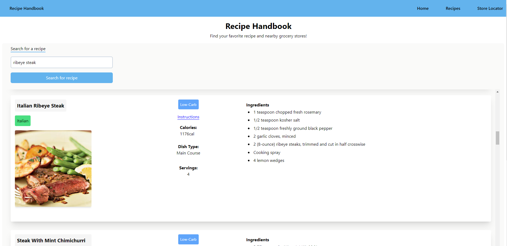

# Recipe Handbook

[link to deployed app](https://dariusgarcia.github.io/group-project/)

## Description

This web app lets users browse a selection of delicious recipes where they can view different facts and details about each recipe.

## User Stories

- [x] User can search a keyword or search for a recipe name.
- [x] User can view different recipes.
- [x] User can view a variety of details and instructions about each recipe.
- [ ] User can enter their zip code to view nearby grocery stores to allow them to find the ingredients for a particular recipe.

## Technologies Used

- [x] JavaScript
- [x] Tailwind CSS
- [x] HTML5
- [x] GitHub Pages

## Usage

Enter a keyword for a recipe to see a list of different recipe results.

## Installation
